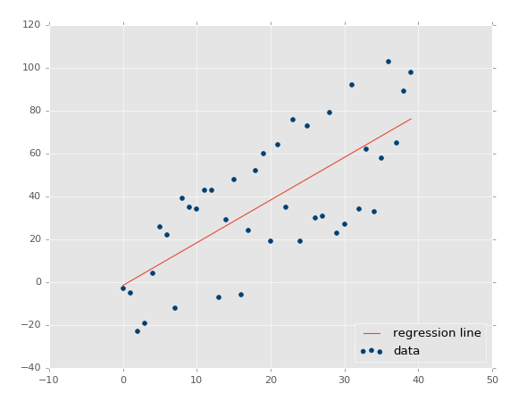
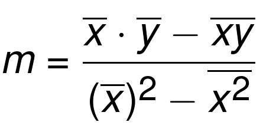

# Machine learning

Machine Learning se definio en 1959 por Arthur Samuel como "El campo de estudio que permite a las computadoras aprender sin ser explicitamente programadas".

## Regresion Lineal

El objetivo de la regresion lineal is buscar una ecuacion que mejore encaje en un conjunto de datos continuos y que permita pronosticar un valor especifico. En su forma mas simple es una recta

(la imagen es de sendex)

Si bien no es el objetivo estudiar la matematicas de todos los algoritmos si es casi fundamental un conocimiento basico de Algebra lineal para poder entender la base en la que se sostiene el "aprendizaje automatico"

Basicamente el objetivo de algebra lineal es calcular la relacion entre puntos de un espacio vectorial.

La regresion lineal nos va a ayudar a encontrar una linea que mejor encaje en un conjunto de datos.

La ecuacion de la recta es:
y = mx + b

los datos que necesito son:
* m: la pendiente
* b: la ordenada al origen, donde cruza al eje y

